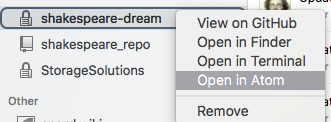

# The Repository for your Shakespeare Play Web page
> **Contents**
><!-- TOC depthFrom:2 depthTo:6 withLinks:1 updateOnSave:1 orderedList:0 -->
- [What to do?](#what-to-do)
	- [What's inside the repository?](#whats-inside-the-repository)
- [Ok, so what do I do now?](#ok-so-what-do-i-do-now)
	- [The Play](#the-play)
	- [The home page cover](#the-home-page-cover)
	- [Making the web site work](#making-the-web-site-work)

<!-- /TOC -->

## What to do?

Before you do anything with your new GitHub account do this:

- Go to your account settings and put in your full name
- Add a picture or avatar of yourself
- Go to settings and change the name of your repo (you can use the name of your play, but this may conflict with others, so include your publisher or surname as well example: _blades-macbeth_)
- Open the GitHub Desktop APP, that you have previously downloaded, and click the + sign top left. Now select _clone_ and select the repo that you have just renamed on GitHub (it should be there if you signed-in).

- You will be asked where to put it…. your Google drive is best! Stay in the GitHub desktop app:
- In the GitHub desktop right-click over the repo name in the left sidebar and select ‘Open in Atom’

- You should see something like this:

### What's inside the repository?
When you download this repository, you will find a variety of files, but the 2 important ones are inside the **docs** folder:

- index.xhtml - this will become the home page for your play. This page will have the cover image.
- play.xhtml - this is where the text of the play will be. Linked from the home page above.
- styles.css -  this is where you define the styles for the elements in the play

You can also have a look at the sample scene inside the **sampleScene** folder

## Ok, so what do I do now?
Here are the steps to take:

- Open InDesign and find your final version of the play (**only the play - not the Introduction**)
- Make any corrections that you like (consider the comments from the previous assignment)
- If you created any new styles you will need to go to the style panel and configure the _Export Tags_ feature.

- Go to File>Export>HTML

### The Play

- You need only to make one change to the settings: **Turn off Generate CSS**
- Locate the file just exported (it will be in your downloads folder)
- Open this file in the text editor that you chose (we suggest **Atom**)
- Copy all of the lines including the `<body>` opening and closing tag.
- Open the _play.xhtml_ file that is inside the docs folder (that you have from your repository) with **Atom**
- Paste into this file and overwrite the `<body>` tag as per the instructions in that file.
- Now edit the _style.css_ file (again inside the docs folder) to style each of the elements in the play
- Review in a web browser
- Validate the XHTML file here: https://validator.w3.org
- Validate the CSS file here: https://jigsaw.w3.org/css-validator/

### The home page cover
- You now need the cover image from the book.
- You can open the PDF of the cover in Photoshop and crop down to the front of the cover. In other words, remove the back and spine.
- The cover image needs to be 1400 pixels wide, because we need this later for the eBook.
- save this image as a JPEG in the **images** folder within the **docs** folder in your repository that you downloaded from GitHub.
- Now edit the index.xhtml file and put the file name of the image where instructed in the markup. Also edit the ALT tag text.
- When you view this index.xhtml file the image will be very large, so you must edit the styles.css file to change the width of the image.
- when viewed in a browser, this image will be a link to the play.
- check that these work.

### Making the web site work
**When you are happy** with the look of these web pages then you can:
- Upload these new versions of these files to your GitHub repository
- also upload the image into the images folder
- In GitHub go to settings for your repository
- Under GitHub Pages choose the **docs folder** for the source

- Your web page for the play will be live!
- When you have finished and are ready then post the URL of your site to the moodle assignment location.

**Please note: **all of this will be demonstrated in class and there will also be a screencast available
