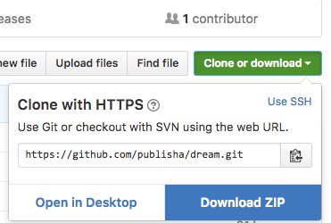

# The Repository for your Shakespeare Play Web page
## What to do?

Before you do anything with your new GitHub account do this:

- Go to your account settings and put in your full name
- Add a picture or avatar of yourself
- you should rename your repository, although you may need to use a unique name in case someone else has already got that name (there are a lot of Macbeths!).

On the home page for your repository locate the green button (Clone or Download)

Click on this green button and select _Download ZIP_. The ZIP file will go into your downloads folder. It may unzip into a folder, but whatever, you must transfer this folder from the downloads to your documents folder or (better still) in your Google drive.

### Editing the files
You can use a variety of editors, Textwrangler if you wish, but the one that we recommend is _Atom_. This can be found here: https://atom.io

You can download and install Atom (free) on your logged-in MAC in the Tonge IT suite and this will be your own copy when you are logged in _to that MAC_. If you move to another MAC then you need to install again. Within Atom, you can install various _packages_ and _themes_. You can install Atom on your own MAC.

### What's inside the repository?
When you download this repository, you will find a variety of files, but the 2 important ones are inside the **docs** folder:

- index.xhtml - this will become the home page for your play. This page will have the cover image.
- play.xhtml - this is where the text of the play will be. Linked from the home page above.
- styles.css -  this is where you define the styles for the elements in the play

You can also have a look at the sample scene inside the **sampleScene** folder

### Ok, so what do I do now?
Here are the steps to take:

- Open InDesign and find your final version of the play (**only the play - not the Introduction**)
- Make any corrections that you like (consider the comments from the previous assignment)
- If you created any new styles you will need to go to the style panel and configure the _Export Tags_ feature.

- Go to File>Export>HTML

#### The Play

- You need only to make one change to the settings: **Turn off Generate CSS**
- Locate the file just exported (it will be in your downloads folder)
- Open this file in the text editor that you chose
- Copy all of the lines including the `<body>` opening and closing tag.
- Open the _play.xhtml_ file that is inside the docs folder (that you have from your repository) with the text editor
- Paste into this file and overwrite the `<body>` tag as per the instructions in that file.
- Now edit the _style.css_ file (again inside the docs folder) to style each of the elements in the play
- Review in a web browser
- Validate the XHTML file here: https://validator.w3.org
- Validate the CSS file here: https://jigsaw.w3.org/css-validator/

#### The home page cover
- You now need the cover image from the book.
- You can open the PDF of the cover in Photoshop and crop down to the front of the cover. In other words, remove the back and spine.
- The cover image needs to be 1400 pixels wide, because we need this later for the eBook.
- save this image as a JPEG in the **images** folder within the **docs** folder in your repository that you downloaded from GitHub.
- Now edit the index.xhtml file and put the file name of the image where instructed in the markup. Also edit the ALT tag text.
- When you view this index.xhtml file the image will be very large, so you must edit the styles.css file to change the width of the image.
- when viewed in a browser, this image will be a link to the play.
- check that these work.

#### Making the web site work
When you are happy with the look of these web pages then you can:
- Upload these new versions of these files to your GitHub repository
- also upload the image into the images folder
- In GitHub go to settings for your repository
- Under GitHub Pages choose the **docs folder** for the source

- Your web page for the play will be live!
- When you have finished and are ready then post the URL of your site to the moodle assignment location.

**Please note: **all of this will be demonstrated in class and there will also be a screencast available
