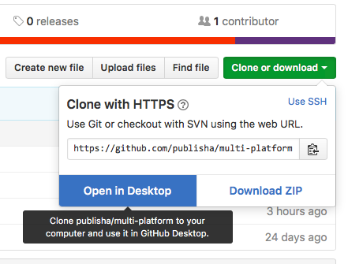
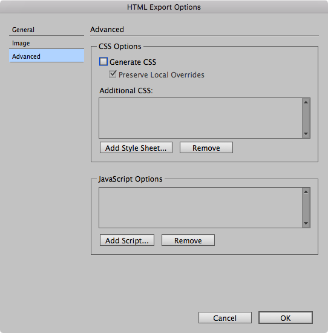

# The Repository for your Shakespeare Play Web page
## What to do?

Before you do anything with your new GitHub account do this:

- Go to your account settings and put in your full name
- Add an picture or avatar of yourself

Now that you are seeing this go to the green button (Clone or Download)

Click on this green button and select _Clone_. Choose a location for your files. All of the files in the repository will now be available for you to edit and use.

### Editing the files
You can use a variety of editors, Textwrangler if you wish, but the one that we recommend is _Atom_. This can be found here: https://atom.io

You can install Atom on your logged-in MAC in the Tonge IT suite and this will be your own copy when you are logged in _to that MAC_. If you move to another MAC then you need to install again. Within Atom, you can install various _packages_ and _themes_.

### What's inside the repository?
When you clone this repository, you will find a variety of files, but the 2 important ones are inside the **docs** folder:

- index.xhtml - this will become the home page for your play
- style.css -  this is where you define the styles for the elements in the play

You can also have a look at the sample scene inside the **sampleScene** folder

### Ok, so what do I do now?
Here are the steps to take:

- Open InDesign and find your final version of the play (**only the play - not the Introduction**)
- Make any corrections that you like (consider the comments from the previous assignment)
- If you created any new styles you will need to go to the style panel and configure the _Export Tags_ feature.

- Go to File>Export>HTML

- You need only to make one change to the settings: **Turn off Generate CSS**
- Locate the file just exported (it will be in your downloads folder)
- Open this file in the text editor that you chose
- Copy all of the lines including the `<body>` opening and closing tag.
- Open the _index.xhtml_ file that is inside the docs folder (that you have from your repository) with the text editor
- Paste into this file and overwrite the `<body>` tag as per the instructions in that file.
- Now edit the _style.css_ file (again inside the docs folder) to style each of the elements in the play
- Review in a web browser
- Validate the XHTML file here: https://validator.w3.org
- Validate the CSS file here: https://jigsaw.w3.org/css-validator/
- Upload these 2 new versions of these files to your GitHub repository
- In GitHub go to settings for your repository
- Under GitHub Pages choose the **docs folder** for the source

- Your web page for the play will be live!

**Please note: **this will be demonstrated in class and there will be a screencast available
